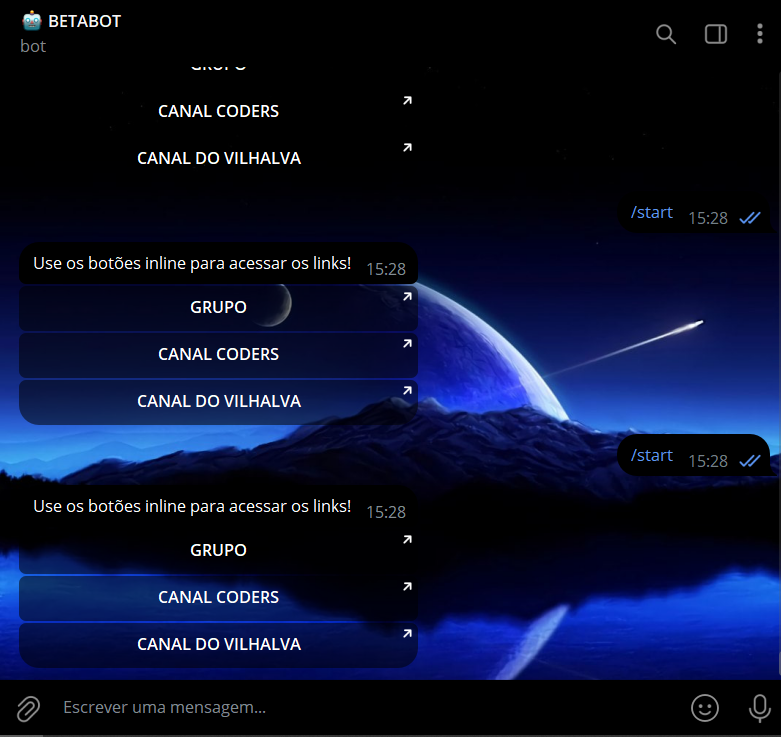

# URLS COM TELEGRAF
🤤ESSE É UM BOT DO TELEGRAM QUE ENVIA BOTÕES INLINE CONTENDO LINKS COM TELEGRAF (NODEJS/JS)!

 <br>

## DESCRIÇÃO:
Este bot do Telegram é projetado para fornecer links para grupos e canais específicos usando botões inline. Quando um usuário clica em um botão, ele será redirecionado para o link correspondente.

1. **Comando /start**:
   - Inicia o bot e envia uma mensagem de boas-vindas ao usuário.
   - Exibe botões inline com links para grupos e canais do Telegram.

## EXECUTANDO O PROJETO:
1. **Editar o código:**
   - Certifique-se de substituir "seu_token_aqui" pelas informações corretas das suas credenciais em `CODIGO/.env`.

2. **Instalando as Depêndencias:**
   - Para instalar as dependências listadas no arquivo "package.json", você pode usar o comando `npm install` no terminal. Certifique-se de estar no diretório do seu projeto onde o arquivo "package.json" está localizado (`CODIGO`). O npm irá ler o arquivo "package.json" e instalar todas as dependências listadas nele. 

   ```bash
   npm install
   ```

3. **Inicie o Bot:**
   - Execute o bot do Telegram iniciando-o com o seguinte comando:
    ```bash
    npm start
    ```

4. **Interagindo com o Bot:**
   - Abra o Telegram e inicie uma conversa com o bot.
   - Envie o comando `/start` para iniciar o bot.
   - Após enviar o comando `/start`, o bot responderá com uma mensagem de boas-vindas e exibirá os botões inline com links para grupos e canais do Telegram.
   - Clique em qualquer um dos botões inline para ser redirecionado para o link correspondente.

## NÃO SABE?
- Entendemos que para manipular arquivos em muitas linguagens e tecnologias relacionadas, é necessário possuir conhecimento nessas áreas. Para auxiliar nesse aprendizado, oferecemos cursos gratuitos disponíveis:
* [CURSO DE TELEGRAF](https://github.com/VILHALVA/CURSO-DE-TELEGRAF)
* [CURSO DE JAVASCRIPT](https://github.com/VILHALVA/CURSO-DE-JAVASCRIPT)
* [CURSO DE NODEJS](https://github.com/VILHALVA/CURSO-DE-NODEJS)
* [CONFIRA MAIS CURSOS](https://github.com/VILHALVA?tab=repositories&q=+topic:CURSO)

## CREDITOS:
- [PROJETO BASEADO NO "BOTOES DE URL"](https://github.com/VILHALVA/BOTOES-DE-URL)
- [PROJETO FEITO PELO VILHALVA](https://github.com/VILHALVA)

